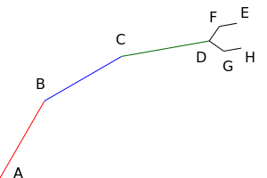

---

# Цель работы

1. Уметь структурировать программу при помощи функций и структур.
1. Уметь писать модульные тесты.


# Часть 1. Декомпозиция программы функциями

## Задание

Программа для построения гистограммы из ЛР № 1 состоит из одной функции
`main()` на более чем 100 строк, из-за чего в ней неудобно ориентироваться.
Необходимо выделить части программы в функции:

* Ввод чисел:
    * принимает количество чисел, которое необходимо ввести;
    * возвращает вектор чисел.
* Поиск наибольшего и наименьшего значения:
    * принимает вектор чисел;
    * возвращает два результата — min и max.
* Расчет гистограммы:
    * принимает вектор чисел и количество корзин;
    * возвращает вектор количеств чисел в каждой корзине;
    * *вызывает* в процессе работы функцию поиска min и max.

При отсутствии решения ЛР № 1 его можно взять [здесь][github].

[github]: https://github.com/PlushBeaver/cs19-lab01


## Указания

### Функция ввода чисел

Сколько параметров у функции?  Один — количество вводимых чисел.  Сколько
и каких значений функция возвращает?  Одно значение — вектор из действительных
чисел. Что функция позволяет *сделать?*  Ввести числа (input numbers).  Таким
образом, функция имеет вид:

``` cpp
vector<double>
input_numbers(size_t count) {
    vector<double> result(count);
    for (size_t i = 0; i < count; i++) {
        cin >> result[i];
    }
    return result;
}
```

Современный C++ (C++11 и выше) позволяет просто возвращать из функции вектор,
и это будет работать эффективно, каков бы ни был его размер.

В основной программе (в функции `main()`) ввод чисел заменяется вызовом
новой функции:

``` cpp
size_t number_count;
cin >> number_count;
vector<double> numbers = input_numbers(number_count);
```


### Вывод типов переменных

Выбран ли тип переменной `numbers` наилучшим образом?

Можно заметить, что в дальнейшем `numbers` не изменяется, следовательно, можно
сделать ее константной:

``` cpp
const vector<double> numbers = input_numbers(number_count);
```

Теперь тип `numbers` занимает половину строки, что может быть неудобно читать.
Можно заметить, что тип `numbers` обязан совпадать с типом возвращаемого
значения функции `input_numbers()`, то есть избыточен.  В современном С++ есть
способ указать компилятору *вывести* тип переменной `numbers` из выражения,
которое ей присваивается:

``` cpp
const auto numbers = input_numbers(number_count);
```

**Ключевое слово `auto` не вводит новый тип.**  Переменная `numbers`
по-прежнему является `const vector<double>`, просто это записано короче, так
как компилятору это известно без явного указания.  Стала ли программа более
читаемой?  Ответ неоднозначен.  Код сократился, но теперь из него не очевидно
(человеку), каков тип `numbers`; с другой стороны, читателю может и не быть
важно, как представлены `numbers` — достаточно того, что там числа (это ясно
из названия функции). Вывод: использовать `auto` следует там, где это
сокращает код без сокрытия важных подробностей.


### Функция поиска минимума и максимума

При поиске минимума и максимума результата два — классический пример, когда
можно результаты функции передать не через возвращаемое значение,
а через параметры.  Типом выходных параметров не может быть `double`, потому
что это тип *значений,* и параметры этого типа будут отдельными переменными,
которые существуют в пределах функции, а следовательно, после ее вызова их
нельзя будет считать.  Остаются либо ссылки, либо указатели.

Если выбрать ссылки, их всегда придется передавать в функцию, изнутри которой
они будут доступны без особого синтаксиса:

``` cpp
void
find_minmax(vector<double> numbers, double& min, double& max) {
    min = numbers[0];
    // ...
}

// ...
double min, max;
find_minmax(numbers, min, max);
```

При использовании указателей их потребуется разыменовывать в функции,
а при вызове нужно будет передавать не переменные, а их адреса:

``` cpp
void
find_minmax(vector<double> numbers, double* min, double* max) {
    *min = numbers[0];
    // ...
}

// ...
double min, max;
find_minmax(numbers, &min, &max);
```

(@) Выделите в программе функцию `find_minmax()` в любом варианте,
    добейтесь компиляции и корректной работы программы.


### Передача по константной ссылке

Оптимально ли выбран тип входного параметра `numbers`?  Во-первых, изменять
его не требуется, он может быть константным.  Во-вторых, поскольку он
не объявлен ссылкой или указателем, это отдельная переменная, которая получает
значением копию вектора, который передается в функцию.  Однако копия не нужна.
Итого выгоднее использовать константную ссылку:
`const vector<double>& numbers`.

(@) Выделите поиск минимума и максимума в функцию `find_minmax()`.
    Типы всех парамтеров выберите на свое усмотрение.

(@) Выделите расчет количества чисел в столбцах гистограммы
    в функцию `make_histogram()`.

(@) Выделите отображение гистограммы в функцию `show_histogram_text()`.


## Декомпозиция программы

Итоговая функция `main()` принимает вид (за вычетом оформления):

``` cpp
size_t number_count;
cin >> number_count;
const auto numbers = input_numbers(number_count);
size_t bin_count;
cin >> bin_count;

const auto bins = make_histogram(numbers, bin_count);

show_histogram_text(bins);
```

Можно видеть, что функциями фактически выделены блоки ввода данных,
обработки данных и вывода результатов.  Ввод данных частично находится
вне функции `input_numbers()`, потому что иначе она оказалась бы слишком специфичной,
«заточенной» под программу.  Функция же ввода массива может быть полезной
во многих случаях.

Помимо выделения блоков кода, функции определяют взаимодействие между частями
программы и скрывают реализацию этих частей.  Через типы параметров функций
и их возвращаемых значений фиксируется, какой информацией обмениваются
части программы *(интерфейсы* этих частей, не путать с интерфейсом
пользователя).  При грамотной декомпозиции интерфейсы сохраняются (иногда
дополняясь) при модернизации частей программы.

(@) Добейтесь корректной работы программы.

(@) Сделайте коммит с текущим состоянием проекта и отправьте его на GitHub.

Если вы клонировали авторское решение ЛР № 1, изменить адрес репозитария
на собственный можно такой командой (с правильным адресом):

``` sh
git remote set-url origin https://github.com/<username>/<repo>.git
```


# Часть 2. Вывод гистограммы как изображения в формате SVG

Изображения в формате SVG представляют собой текстовые файлы, в которых
перечислены геометрические фигуры (линии, прямоугольники и прочие) и их
свойства (положение, размер, цвет и другие). Кроме самих геометрических фигур,
файл содержит заголовок и окончание.

Например, [такой файл SVG][svg/example] описывает изображение размером 200×300
точек с линией из точки *(0, 0)* в точку *(100, 100)* синего цвета толщиной
4 точки:

``` xml
<?xml version='1.0' encoding='UTF-8' ?>
<svg width='200' height='300' viewBox='0 0 200 300' xmlns='http://www.w3.org/2000/svg'>
<line x1='0' y1='0' x2='100' y2='100' stroke='blue' stroke-width='4'/>
</svg>
```

Здесь строка `<line... />` описывает линию.  Выше нее находится заголовок
файла, ниже нее — окончание файла.

Система координат SVG отличается от математической: ось Y направлена вниз,
то есть точка *(0,0)* находится в верхнем левом углу.  Координаты в SVG
действительные, то есть может быть точка *(0.5, 3.14).*

Фрагменты вида `<svg>` или `<line>` называются *элементами,* или *тэгами.*
Параметры вида `height='300'` называются *атрибутами* элементов.
Подробнее об SVG можно прочитать [здесь][svg/reference].

Кроме линий, SVG поддерживает множество элементов, среди них:

* `<text x="20" y="35">anything you want</text>`:
    текст «anything you want», левый нижний угол которого в точке *(20,35);*
* `<rect x="0" y="0" width="100" height="200" />`:
    прямоугольник 100×200 с верхним левым углом в точке *(0,0)*.

[svg/example]: example.svg
[svg/reference]: https://developer.mozilla.org/en-US/docs/Web/SVG/Element


## Задача

Требуется переделать вывод гистограммы на формат SVG.


## Указания

С точки зрения SVG, гистограмма представляет собой элементы `<text>`
с подписями столбцов и элементы `<rect>` напротив них — столбцы гистограммы.

Вывод отдельных элементов SVG (заголовка, окончания, текста, прямоугольника)
стоит оформить в виде функций, который будут принимать параметры геометрии
и печатать соответствующий текст.  Весь вывод гистограммы в SVG реализуем
в функции `show_histogram_svg()`, интерфейс которой не отличается
от `show_historgam_text()`, вызов которой заменим вызовом новой функции.

Для проверки работы программы можно направлять ее стандартный вывод в файл
с расширением SVG и просматривать его в браузере.


### Вывод заголовка и окончания SVG

Отработаем цикл модификации и проверки программы на примере пустого
изображения.  Вот готовые функции вывода заголовка и окончания SVG:

``` cpp
void
svg_begin(double width, double height) {
    cout << "<?xml version='1.0' encoding='UTF-8'?>\n";
    cout << "<svg width='" << width << "' << height='" << height "' "
         << "viewBox='0 0 " << width << " " << height << "' "
         << "xmlns='http://www.w3.org/2000/svg'>\n";
}

void
svg_end() {
    cout << "</svg>\n";
}
```

Обратите внимание на пробелы в строках, например, перед закрывающей кавычкой
во фрагменте `"viewBox='0 0 "`.  Также обратите внимание на использование
одинарных кавычек.  Двойные кавычки ограничивают в C++ строковые литералы;
одинарные кавычки внутри них выводятся «как есть» в результирующую строку.
Путаница кавычек или отсутствие некоторых пробелов сделает SVG некорректным.

Пусть начальная реализация графического вывода гистограммы всегда выводит
пустое изображение фиксированного размера:

``` cpp
void
show_histogram_svg(const vector<size_t>& bins) {
    svg_begin(400, 300);
    svg_end();
}
```

Заменим вызов `show_histogram_text(bins)` вызовом `show_histogram_svg(bins)`.

Создать файл изображения можно так:

``` sh
C:\lab03-histogram> bin/Debug/lab03-histogram.exe <marks.txt >marks.svg
```

В браузере `marks.svg` открывается из меню *Файл → Открыть...*  Отобразится
пустая страница (пустой рисунок).  Можно нажать *Ctrl+U* или пункт *«Исходный
код страницы»* в контекстном меню любого места страницы, чтобы увидеть
результирующий код SVG.


### Функции вывода элементов SVG

(@) Напишите функцию для вывода текста в SVG, которая принимает координату
    по горизонтали (`left`), координату нижнего края текста по вертикали
    (`baseline`) и сам текст:

    ``` cpp
    void svg_text(double left, double baseline, string text);
    ```

Для проверки выведем высоту первого столбца гистограммы:

``` cpp
void
show_histogram_svg(const vector<size_t>& bins) {
    svg_begin(400, 300);
    svg_text(20, 20, to_string(bins[0]));
    svg_end();
}
```

Функция `to_string()` преобразует значения разных типов в строки.

Чтобы проверить модифицированную программу, её нужно запустить повторно:

``` sh
C:\lab03-histogram> bin/Debug/lab03-histogram.exe <marks.txt >marks.svg
```

После повторного запуска программы открытый в браузере файл можно обновить
клавишей *F5.*  На странице должен быть виден текст «2».  Если в файле ошибка,
он не отобразится.  В этом случае нужно просмотреть код страницы на предмет
ошибок в SVG, исправить код программы, перезапустить ее и проверить результат.

(@) Напишите функцию для вывода прямоугольника в SVG:

    ``` cpp
    void svg_rect(double x, double y, double width, double height);
    ```

Для проверки выведем первый столбец гистограммы справа от подписи к нему:

``` cpp
    svg_rect(50, 0, bins[0] * 10, 30);
```

(@) Убедитесь, что вывод первого столбца гистограммы работает.


### Исключение «магических констант»

Текст выводится в координатах *(20, 20)*, смещение левого края столбца *50*
(оно же — ширина подписей), а высота столбца *30.*  Эти числа подобраны так,
чтобы элементы гистограммы не накладывались друг на друга, но они разбросаны
по коду и их смысл неясен.

Прямо внутри функции `show_histogram_svg()` заведем константы:

``` cpp
const auto IMAGE_WIDTH = 400;
const auto IMAGE_HEIGHT = 300;
const auto TEXT_LEFT = 20;
const auto TEXT_BASELINE = 20;
const auto TEXT_WIDTH = 50;
const auto BIN_HEIGHT = 30;
```

(@) Замените «магические числа» константами и проверьте работу программы.


### Вывод гистограммы

Логика вывода гистограммы следующая: каждая корзина выводится так же,
как первая, но к вертикальной координате добавляется смещение — высота
столбца:

``` cpp
double top = 0;
for (size_t bin : bins) {
    const double bin_width = 10 * bin;
    svg_text(TEXT_LEFT, top + TEXT_BASELINE, to_string(bin));
    svg_rect(TEXT_WIDTH, top, bin_width, BIN_HEIGHT);
}
```

«Магическая константа» 10 пока сохраняется, потому что логика расчета ширины
прямоугольника еще будет модифицироваться.

(@) Реализуйте вывод гистограммы и проверьте работу программы.


### Оформление гистограммы. Значения параметров по умолчанию

Черная гистограмма не слишком эстетична или экономична при печати.
За цвет линий в SVG отвечает атрибут `stroke`, а за цвет заливки — `fill`.
Можно задать один из [стандартных цветов][svg/colors] или выбрать цвет
в формате `#RRGGBB` из [палитры][svg/rgb].  Пример прямоугольника с красными
границами и бледно-розовой заливкой:

``` xml
<rect x='50' y='0' width='30' height='30' stroke='red' fill='#ffeeee'/>
```

[svg/colors]: https://www.december.com/html/spec/colorsvghex.html
[svg/rgb]: http://getcolor.ru

(@) Доработайте функцию `svg_rect()` для указания цвета линий и заливки:

    ``` cpp
    void svg_rect(double x, double y, double width, double height,
            string stroke, string fill);
    ```

(@) Измените цвета вывода и проверьте работу программы.


#### Значения параметров по умолчанию

Цвета элементов нужно задавать не всегда, а в текущей реализации у функции
`svg_rect()` шесть параметров, два из которых отвечают за цвет.  Можно
было бы перегрузить функцию:

``` cpp
void svg_rect(double x, double y, double width, double height);

void svg_rect(double x, double y, double width, double height,
        string stroke, string fill);
```

Однако в этом случае пришлось бы в каждой функции писать похожий код.
В данном случае выгоднее применить значения параметров по умолчанию:

``` cpp
void svg_rect(double x, double y, double width, double height,
        string stroke = "black", string fill = "black");
```

Значения по умолчанию указываются только один раз, обычно в определении
функции (если объявление и определение отделены).  Новая версия `svg_rect()`
работает так:

``` cpp
svg_rect(0, 0, 100, 200);             // svg_rect(0, 0, 100, 200, "black", "black");
svg_rect(0, 0, 100, 200, "red");      // svg_rect(0, 0, 100, 200, "red",   "black");
svg_rect(0, 0, 100, 200, "blue", 4);
```

(@) Добавьте значения параметров по умолчанию функции `svg_rect()`.

(@) Сделайте коммит и отправите изменения на GitHub.

(@) *(Домашнее задание.)  Реализуйте для гистограммы в SVG масштабирование,
    как было сделано для текста в ЛР № 1.  Опубликуйте коммит.


# Часть 3. Модульное тестирование

Ранее для тестирования программы применялось перенаправление ввода и вывода.
Такое тестирование называется функциональным.  Однако функционального
тестирования недостаточно для больших программ.  Предположим, большая
программа перестала выдавать правильный результат — как найти место ошибки?
Необязательно это последнее изменение: возможно, другая часть и ранее работала
неверно в некоторых случаях, и последняя правка лишь привела к такому случаю.

Модульное тестирование (unit testing) проверяет не работу всей программы,
а работу отдельных ее компонент, например, отдельных функций.  Модульные
тесты пишутся программистами для собственного кода (функциональные тесты
могут писаться или проводятся вручную другими специалистами).

Модульный тест — это отдельная программа, которая изолированно проверяет
части кода основной программы.  Если желательно протестировать части сложного
алгоритма, эти части должны быть оформлены в виде отдельных функций
(говорят: код должен быть *тестируемым).*


## Задача

Написать модульный тест для функции поиска минимума и максимума.


## Указания

### Выделение тестируемой функции в модуль

Функция `find_minmax()` находится в основном (и единственном) модуле
`main.cpp`.  Для использования функции в других программах нужно вынести
ее код в отдельный модуль.  Модулем в практике C++ называется заголовочный
файл (`*.h`) с объявлениями функций и файл реализации (`*.cpp`) с их
определениями.


#### Создание заголовочного файла

(@) При помощи меню *File → New → File...* добавьте к проекту заголовочный
    файл *(C/C++ header).*  Он должен быть расположен в каталоге проекта:

    *Filename with full path:* `C:\lab03-histogram\histogram.h`

Заготовка файла включает «стража включения» (см. лекции):

``` cpp
#ifndef HISTOGRAM_H_INCLUDED
#define HISTOGRAM_H_INCLUDED

#endif // HISTOGRAM_H_INCLUDED
```

Можно заменить его на более простой вариант `#pragma once` или писать код
в этом файле между `#define` и `#endif`.

(@) Перенесите функцию `find_minmax()` в `histogram.h`.

Помимо самой функции в начало `histogram.h` (под `#pragma once`) нужно
добавить подключение библиотеки векторов и стандартного пространства имен:

``` cpp
#include <vector>

using namespace std;
```

Если теперь попытаться собрать программу, это не удастся: в файле `main.cpp`
функция `find_minmax()` теперь отсутствует.  Необходимо подключить файл
`histogram.h` (в самом начале файла `main.cpp`):

``` cpp
#include "histogram.h"
```

Обратите внимание на использование кавычек вместо угловых скобок: кавычки
означают, что путь к файлу `*.h` написан относительно файла с `#include`,
а угловые скобки предписывают искать включаемый файл по определенным
в настройках путям.

(@) Скомпилируйте программу и проверьте, что она работает.


#### Создание файла реализации

(@) При помощи меню *File → New → File...* добавьте к проекту файл реализации
    *(C/C++ source).*  Необходимые настройки:

    *Filename with full path:* `C:\lab03-histogram\histogram.cpp` \
    *Add file to active project in build target(s)* — нажать *All.*

(@) В `histogram.cpp` подключите `histogram.h`.

(@) Перенесите определение функции `find_minmax()` в `histogram.cpp`.

(@) Оставьте в `histogram.h` от функции `find_minmax()` только объявление:

    ``` cpp
    void find_minmax(const vector<double> numbers, double& min, double& max);
    ```

Если при выделении функции `find_minmax()` были использованы указатели,
а не ссылки, объявление нужно соответствующим образом скорректировать.

(@) Соберите программу и проверьте ее работу.


### Создание проекта для модульных тестов

(@) При помощи меню *File → New → Project...* создайте новый проект типа
    *Empty project.*  Необходимые настройки:

    *Project title:* `lab03-test` \
    *Folder to create project in:* `C:\lab03-histogram` \
    *Project filename:* `lab03-test.cbp` \
    *Resulting filename:* `C:\lab03-histogram\lab03-test.cbp`

(@) Дважды щелкните по проекту `lab03-test`, чтобы сделать его активным.

(@) Из контекстного меню проекта `lab03-test` выберите пункт *Add files...*
    и добавьте к проекту `histogram.h` и `histogram.cpp`.  В открывшемся
    диалоге *Select the targets this file should belong to:* проставьте
    все флажки.

(@) При помощи меню *File → New → File...* добавьте к проекту `lab03-test`
    файл реализации *(C/C++ source).*  Необходимые настройки:

    *Filename with full path:* `C:\lab03-histogram\test.cpp` \
    *Add file to active project in build target(s)* — нажать *All.*


### Написание модульных тестов

Файл `test.cpp` представляет собой полноценную тестирующую программу,
в которой подключен тестируемый модуль, библиотека с `assert()` (см. лекцию)
и присутствует функция `main()`:

``` cpp
#include "histogram.h"

#include <cassert>

int
main() {
}
```

Первый тест будет проверять простой случай массива положительных чисел:

``` cpp
#include "histogram.h"

#include <cassert>

void
test_positive() {
    double min = 0;
    double max = 0;
    find_minmax({1, 2, 3}, min, max);
    assert(min == 1);
    assert(max == 3);
}

int
main() {
    test_positive();
}
```

(@) Соберите программу-тест, запустите ее и убедитесь, что она завершается
    без ошибок, то есть тест проходит.

(@) Замените проверку `max == 3` на `max == 4`.  Соберите и запустите
    программу, чтобы наблюдать образец вывода при провале теста.
    Верните правильную проверку.

(@) Добавьте новые тесты (имена придумайте) на такие случаи:

    * массив из трех отрицательных чисел;
    * массив из трех одинаковых чисел;
    * массив из одного числа.

    Убедитесь, что все тесты проходят.

(@) Добавьте тест на обработку пустого массива и проверьте, проходит ли он.

Если `find_minmax()` в своем начале обращается к `numbers[0]`, программа будет
завершаться аварийно, так как для пустого массива `numbers[0]` нет.

Обратите внимание: тщательное написание модульных тестов позволило выявить
случай, при котором код не работает.  Выходом может быть такое поведение:
в начале `find_minmax()` проверять длину массива (`numbers.size()`),
и если она нулевая, возвращаться из функции без изменения `min` и `max`.
Тест тогда может проверять, что в результате вызова `min` и `max` не меняются.
Возможно, стоит также учесть случай пустого массива в основной программе.

(@) Внесите исправления в `histogram.cpp` (как минимум), пересоберите
    основную программу и тест, убедитесь, что они работают.

(@) Сделайте коммит со всеми новыми файлами и отправите изменения на GitHub.

**Важно:** перед коммитом не забудьте сохранить каждый проект
*(File → Save project).*


# Часть 4. Использование структур и операторов

## Задача

Необходимо отображать конструкцию, изображенную на рисунке, при любых
значениях углов поворота каждого из звеньев:



Все звенья имеют одинаковую длину 100, при нулевом угле поворота
расположены горизонтально.  Программа должна быть расширяемой, то есть
ее должно быть легко доработать под появление новых звеньев.  На ввод
подаются углы поворота в градусах, выводиться должен рисунок в SVG.


## Указания

**Ввод** трех действительных углов не представляет трудностей.

**Обработка данных —** преобразования координат методами линейной алгебры.
Следовательно, в программе потребуется оперировать двумерными точками
и двумерными векторами.  На вход обработки подаются звенья-отрезки
в своем начальном положении, на выходе — отрезки с рассчитанными
координатами после поворотов.

**Вывод данных** потребует написания новой функции `svg_line()` для вывода
линии; эта функция аналогична `svg_rect()`.

Имеется вопрос стыковки части обработки данных и вывода: система координат
SVG отличается от системы координат, принятой в линейной алгебре.  Различие
можно убрать средствами SVG (далее будет показано, как).

Определим структуру `Vec2`, описывающую двумерный вектор (точку в двухмерном
пространстве):

``` cpp
struct Vec2 {
    double x;
    double y;
};
```

Каждое из звеньев AB, BC и CD в начальном положении является горизонтальным
вектором длиной 100, то есть их координата X равна 100, координата Y равна 0:

``` cpp
int
main() {
    Vec2 AB{100, 0};
    Vec2 BC{100, 0};
    Vec2 CD{100, 0};
```

Захват манипулятора состоит из одинаковых звеньев («фаланг»), но под разным
углом поворота; определим сначала одно такое звено:

``` cpp
Vec2 falange{20, 0};
```

На основе `falange` необходимо создать четыре других звена:

* DE: поворотом `falange` на 45 градусов против часовой стрелки;
* EF: такое же, как `falange`;
* DG: поворотом `fanalge` на 45 градусов по часовой стрелке;
* GH: такое же, как `falange`.

Необходимо иметь возможность по вектору и углу поворота в градусах получать
повернутый вектор.  Формула для расчета:

```
X' = X × cos α - Y × sin α
Y' = X × sin α + Y × cos α
```

Рационально создать функцию `rotate()` для такого преобразования. В этой
функции понадобится число π для преобразования из градусов в радианы, синус
и косинус.  Для этого в начале программы нужно подключить математическую
библиотеку:

``` cpp
#define _USE_MATH_DEFINES
#include <cmath>
```

После этого π будет доступно как `M_PI`, синус и косинус как `sin` и `cos`:

``` cpp
Vec2
rotate(Vec2 v, double degree) {
    const double radian = M_PI / 180 * degree;
    const double sin_a = sin(radians);
    const double cos_a = sqrt(1 - sin_a * sin_a);
    Vec2 r;
    r.x = v.x * cos_a - v.y * sin_a;
    r.y = v.x * sin_a + v.y * cos_a;
    return r;
```

С помощью `rotate()` в функции `main()` можно определить векторы захвата:

``` cpp
    Vec2 DE = rotate(falange, 45);
    Vec2 EF = falange;
    Vec2 DG = rotate(falange, -45);
    Vec2 GH = falange;
```

Зададим углы поворота прямо в программе произвольными:

``` cpp
double alpha = 60;
double beta = -30;
double gamma = 30;
```

Начнем вычисление точек манипулятора; для пробы вычислим положение первого
звена:

``` cpp
Vec2 A = {0, 0};
Vec2 B = A + rotate(AB, alpha);
```

Если попытаться скомпилировать программу, это не удастся: операция сложения
для векторов не определена.  C++ позволяет *перегрузку операторов:* можно
определить функцию под специальным именем `operator+`, которая будет принимать
два вектора и возвращать вектор-сумму:

``` cpp
Vec2
operator+(Vec2 lhs, Vec2 rhs) {
    ...
}
```

(@) Реализуйте оператор сложения векторов.

Продолжим вычисление точек:

``` cpp
Vec2 C = B + rotate(BC, alpha + beta);
Vec2 D = C + rotate(CD, alpha + beta + gamma);
```

(@) Запишите вычисление всех оставшихся точек.
    (Все они повернуты на угол *α + β + γ*.)

(@) Напишите функцию для отображения линии в SVG:

    ``` cpp
    void svg_line(double x1, double y1, double x2, double y2, string color);
    ```

Функция `svg_line()` универсальная, но в данной программе было бы удобнее,
чтобы она принимала не отдельные координаты, а целые точки.  Для этого можно
перегрузить `svg_line()`: создать функцию с таким же именем, но другими
типами параметров.  Новая функция может для выполнения своей задачи вызывать
старую.

(@) Реализуйте перегрузку функции `svg_line()`:

    ``` cpp
    void svg_line(Vec2 begin, Vec2 end, string color);
    ```

Как говорилось выше, на уровне SVG можно решить проблему несоответствия
системы координат линейной алгебры и SVG.  Для этого функции вывода заголовка
и окончания SVG должны быть немного другими, чем ранее:

``` cpp
void
svg_begin(double width, double height) {
    cout << "<?xml version='1.0' encoding='UTF-8' ?>\n"
         << "<svg width='" << width << "' height='" << height << "' "
         << "viewBox='0 0 " << width << " " << height << "' "
         << "xmlns='http://www.w3.org/2000/svg'>\n"
         << "<g transform='translate(0," << height << ")'>\n"
         << "<g transform='scale(1,-1)'>\n";
}

void
svg_end() {
    cout << "</g>\n"
         << "</g>\n"
         << "</svg>\n";
}
```

Итого можно выполнить отображение манипулятора:

``` cpp
svg_begin(400, 400);
svg_line(A, B, "red");
svg_line(B, C, "blue");
// ...
svg_end();
```

(@) Закончите реализацию вывода SVG. Соберите и запустите программу.
    Убедитесь, что манипулятор находится в ожидаемом положении.

(@) Добавьте в программу ввод углов поворота.

(@) Создайте на GitHub новый репозитарий и отправьте туда код программы.

(@) **(Домашнее задание.)** Добавьте в программу ввод угла раскрытия захвата
    манипулятора `theta` и его учет в расчете точек E, F, G и H.
    Опубликуйте коммит.
